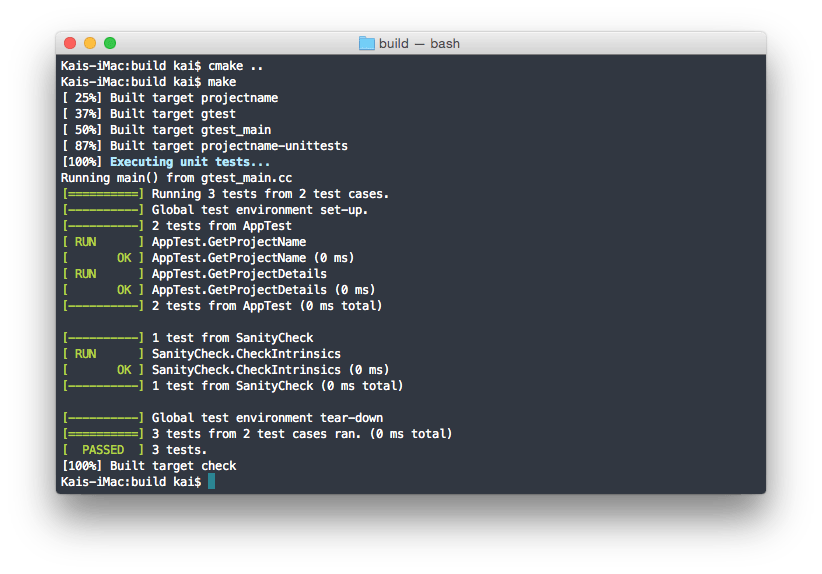
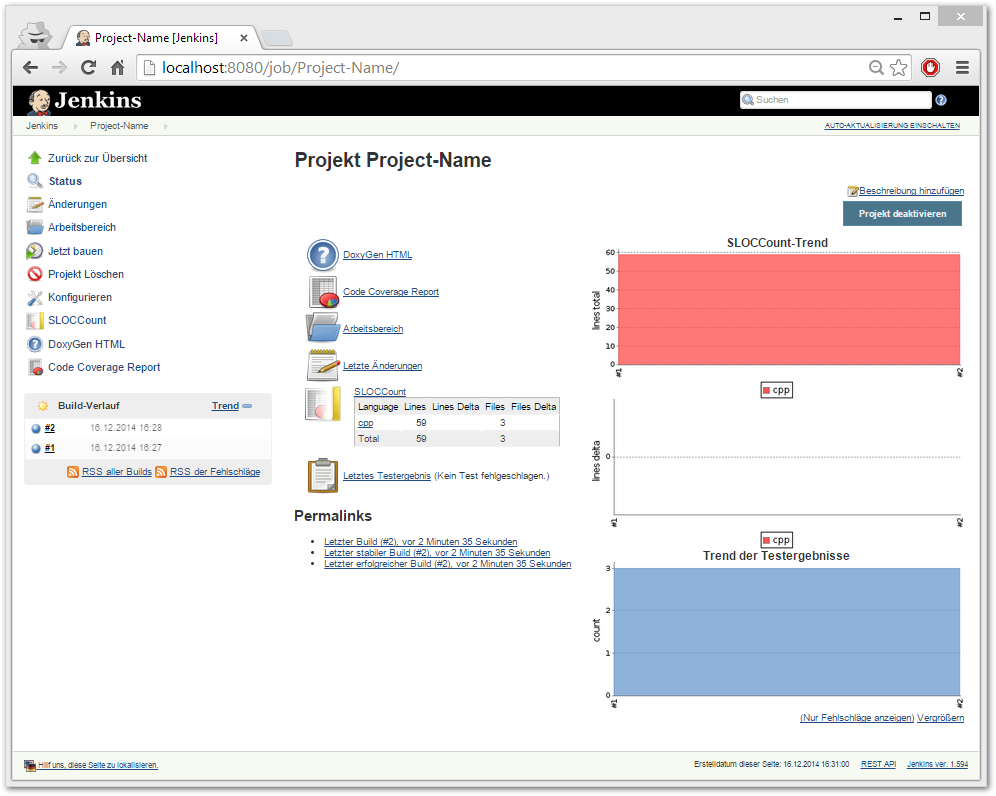
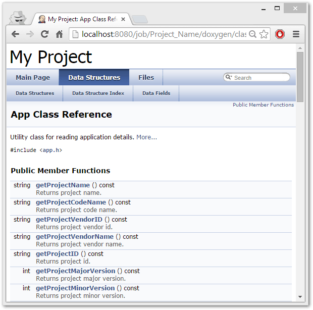
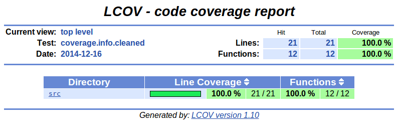

Also look here https://github.com/puppetlabs/cpp-project-template
## Creating a new project

This is most simply accomplished with [Hub](https://hub.github.com/). The following commands will create a new GitHub project based on this template named `new-project` under the `puppetlabs` organization. Use Hub's `-p` option to create a private repo.

```
hub clone --depth 1 --origin source puppetlabs/cpp-project-template new-project
cd new-project
hub create puppetlabs/new-project [-p]
git commit --amend # Rewrite the commit message, and erase the fact that it's a shallow copy
git push origin new-project
```

Finally update the project() name in CMakeLists.txt.

# Cpp-Project-Template

[](https://travis-ci.org/NewProggie/Cpp-Project-Template)

Creating a (large scaling) C++ project from scratch can be cumbersome. The purpose of this project is to provide a bootstrap project layout which makes this task more easy. This includes:

 * CMake build system
 * Googletest C++ Testing which has no external dependencies and builds inside the project
 * LCOV Code Coverage Report using `-fprofile-arcs` and `-ftest-coverage` compiler features
 * Doxygen code documentation generation
 * Preconfigured Jenkins CI, production ready from the start
 * Travis configuration for CI in case one doesn't want to use Jenkins CI
 * Vagrant Box with automagically configured Jenkins CI

 
 
 
 

## Prerequisites
This project requires:
 * Cross-platform Make (CMake) v2.8+
 * GNU Make or equivalent
 * GCC or an alternative, reasonably conformant C++ compiler
 * Boost C++ Libraries v1.55+ [HEADERS and LIBRARIES]

## Building
This project uses the CMake build system. However, there exists wrapper
configure script together with a Makefile so that the typical build invocation
of `./configure` followed by `make` will work.

## Acknowledgments
 * Some parts of this bootstrap project template are inspired by https://code.google.com/p/cpp-project- template/.
 * Adjusted CodeCoverage to ignore thirdparty directory
